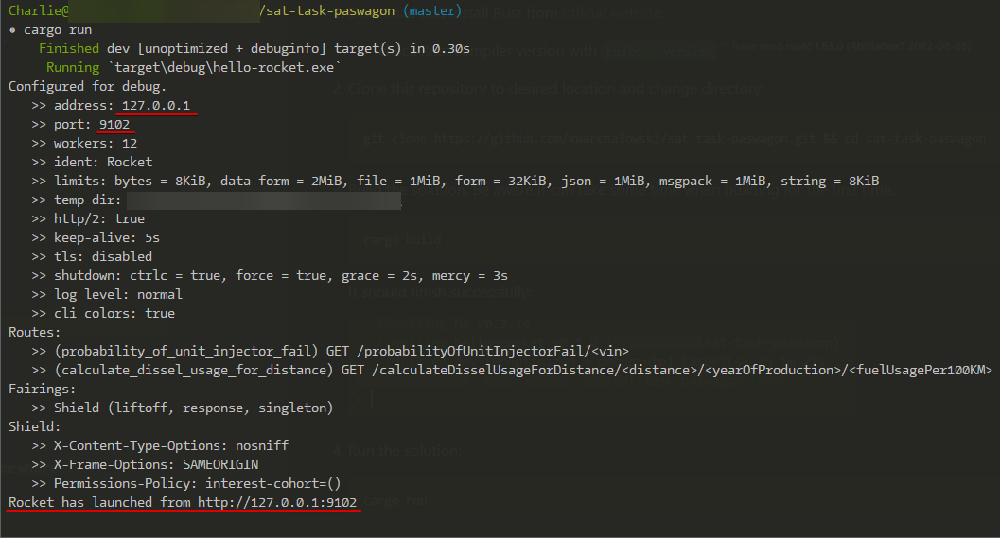

<h1 align="center">👋 Hey there, SAT People 😸</h1>
<h6 align="center">Warsaw, Poland</h6>


# 💭 | What's that? 
Two REST API GET endpoints implemented in Rust (Rocket).

# 🏃 | Install and run 

1. Download and install Rust from [official website](https://www.rust-lang.org/tools/install).
    * check Rust compiler version with `rustc --version` <sup>\*I have used **rustc 1.63.0 (4b91a6ea7 2022-08-08)**</sup>

<br>

2. Clone this repository to desired location and change directory:

    ```
    git clone https://github.com/kwarchalowski/sat-task-paswagon.git && cd sat-task-paswagon
    ```

<br>

3. Build the solution. Be aware it can take some time when building for the first time.

    ```
    cargo build
    ```

    It should finish successfully:
    
    

<br>

4. Run the solution:

    ```
    cargo run
    ```

    After successful run you should see basic info about our running Rust/Rocket API:

    

    You can use underlined address to send request to APIs endpoints. You can change them <sup>[see how](#ip_port_config)</sup>.

<br>

5. Run implemented tests: 

    ```
    cargo test
    ```

    Outcome:

    


# <a name="ip_port_config"></a> 🛠️ | IP address and port
You can change the IP address and port used for our API in `Rocket.toml` file in main `/sat-task-paswagon` directory.

```JavaScript
[global]
address = "127.0.0.1"
port = 9102
```

<br>

# ☎️ | API calls

```html
GET     /calculateDisselUsageForDistance/<distance>/<yearOfProduction>/<fuelUsagePer100KM>

        distance - natural number (≥ 0)
        yearOfProduction - natural number (1885 - current)
        fuelUsagePer100KM - natural number (≥ 0)
```


```html
GET     /probabilityOfUnitInjectorFail/<vin>
        
        vin - string
```

Just call the endpoint as you like, browser, Postman or curl:

`curl http://127.0.0.1:9102/probabilityOfUnitInjectorFail/WW42088725PL`


Running API should respond with calculated content:
> 0,3 

and the logs will be shown in running terminal:


<br>

# 💬 Contact me
- :globe_with_meridians: [Homepage](https://warchalowski.pl)
- :telephone: [LinkedIn](https://www.linkedin.com/in/karol-warcha%C5%82owski/) profile
- :loud_sound: [Discord](https://discord.com/users/221202392685871114)
- :e-mail: [email me](mailto:karol@warchalowski.pl) directly
